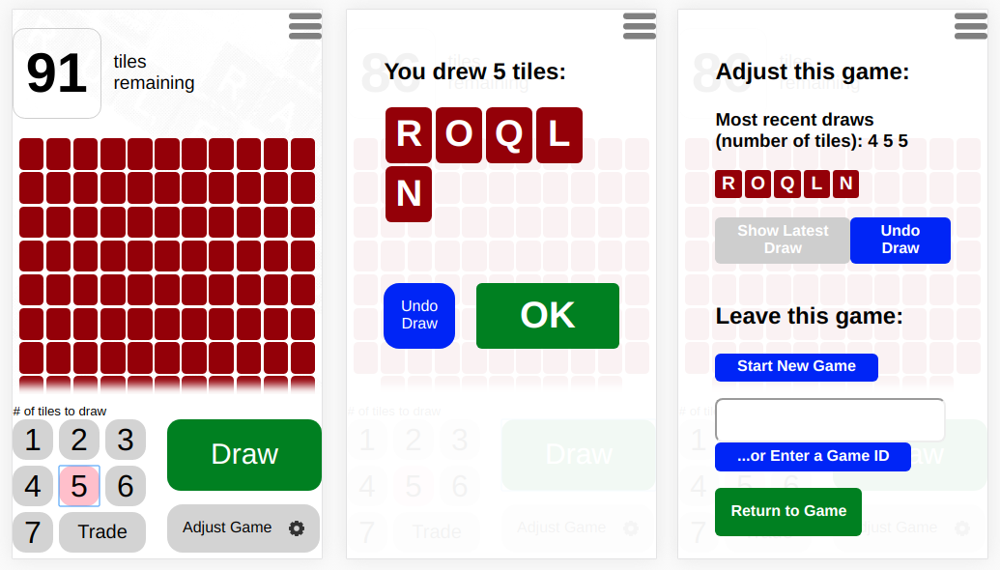

# Scrabblebag

Scrabblebag is not Scrabble -- it's just the bag. Players can draw letters until the bag runs out.

Why is this useful? Because it makes remote play more accessible to people who don't want to (or *can't*) play a whole game on a phone, but who *do* wish they could play with loved ones far away.

In conjunction with an old-fashioned telephone, this gizmo lets players share a pool of letters, while each plays with real tiles on a physical board wherever they are.

Call a friend you want to play with and **[visit Scrabblebag here](http://jeremy-rose.com/scrabblebag)**.

## Design Considerations
For practical reasons, the layout is designed for portable devices first, though the desktop version is equally functional. The target audience is composed not of digital natives, but rather of those who might prefer *not* to use their portable devices. Controls and visual feedback are meant to display at large size, clearly, and with a simple primary color scheme.

## Technologies
* Vanilla JavaScript
* HTML/CSS
* A thin whisp of PHP
* API - MongoDB via Express.js, [repository here](https://github.com/jeremyrrose/scrabblebag-api)
